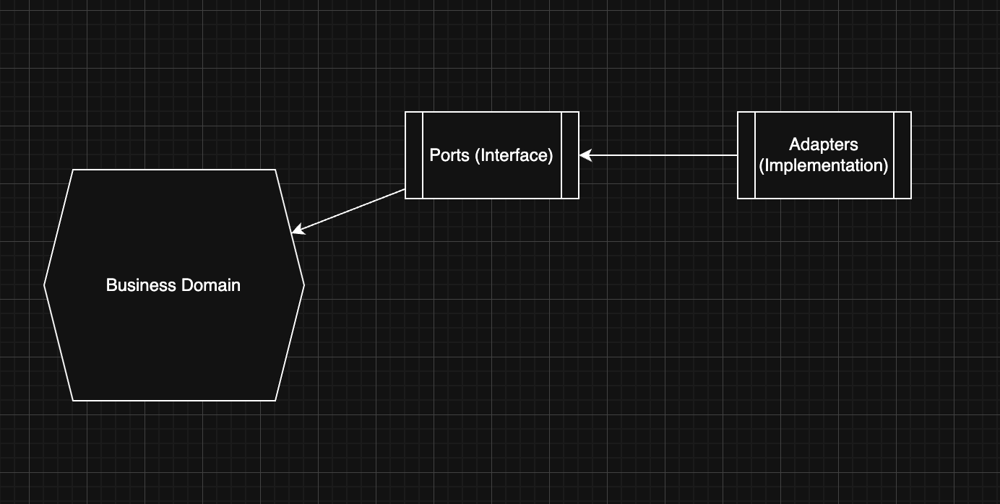

# Nestjs Domain Driven Design Patterns

## Hexagonal Architecture
> also known as Ports and Adapters Architecture, aiming to create a highly decoupled and testable application by emphasizing the seperation of concerns between the core business logic and external concerns.

<p align="center"></p>


Application Layer
- application service
- facade handlers
will communicate with data access components and message broker and other external system through **ports** (interfaces)

Domain Layer
- entities
- value objects: immutable, side-effect free, equal by value
- domain events

Infrastructure Layer
- data access components
- message broker
- external system
will implement ports with application layer, called adapters.

Representer Layer
- controllers
- gateways
- user-facing components


```
.
└── src
    └── alarm (module -> bounded context)
        ├── application
        ├── domain
        ├── infrastructure
        └── presenter
```